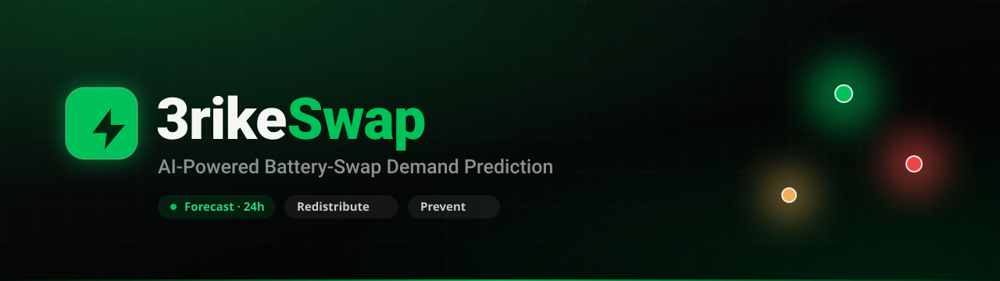
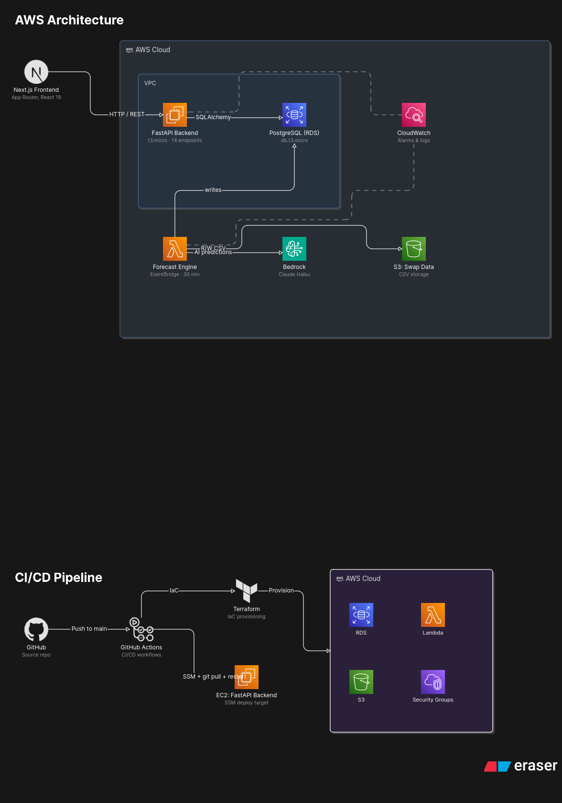

<div align="center">



<br/>

**Predict where batteries will be needed, catch shortages before they happen, and redistribute inventory intelligently — across an entire swap-station network.**

[](https://nextjs.org)
[](https://react.dev)
[](https://www.typescriptlang.org)
[](https://tailwindcss.com)
[](https://fastapi.tiangolo.com)
[](https://aws.amazon.com)

**🔗 Live demo: [admin-3rike-swap.vercel.app](https://3rike-swap.vercel.app/)**

<sub>Built for the **One With AI Hackathon** by **Arthurite Integrated — Team 3rike** · Problem Statement 6: Battery-Swapping Demand</sub>

</div>

---

## The Problem

Battery-swapping operators across Africa face a silent operational crisis: **batteries sit idle at one station while riders queue empty-handed at another.** Shortages happen not because there aren't enough batteries — but because no one knows *where they'll be needed next*.

Today, restocking is **reactive** — decided by human observation, after a station has already run dry. The cost is rider downtime, lost revenue, and churn.

> **Problem Statement 6 — One With AI Hackathon**
> *"Develop a platform that enables battery-swapping operators to forecast demand across their network of swap stations. The solution should help operators understand **where** batteries will be needed, **when** shortages are likely to occur, and **how** inventory can be redistributed efficiently."*

## Our Solution

3rike Swap is an **AI demand-forecasting platform** that gives operators real-time intelligence across their whole network. Powered by **Amazon Bedrock (Claude Haiku 4.5)**, it:

- 📈 **Predicts hourly battery demand** per station for the next 24 hours
- 🚨 **Alerts operators before shortages occur** — not after
- 🔁 **Recommends exactly how many batteries to move, and where** — AI-optimized redistribution
- 🗺️ **Visualizes the entire network live** on an operator dashboard

The result: fewer empty stations, less idle inventory, and a more reliable ride for every driver.

It maps directly onto the three things Problem 6 asks for:

| Challenge | How we solve it |
|---|---|
| **Where** batteries will be needed | Live, color-coded demand heatmap across all stations |
| **When** shortages will occur | 24-hour hourly forecast per station + predictive alerts |
| **How** to redistribute | AI-generated rebalancing plans, one-click dispatch |

---

## ✨ Features

A five-screen operator console, all running on live data:

- **Operations Dashboard** — network KPIs, a pulsing demand heatmap, and a live shortage-alert feed.
- **Station Network** — every station with inventory, swaps, and time-to-empty; live search, status filters, and **Add Station**.
- **AI Forecasting** — predicted-vs-actual demand chart with a shortage-risk band, plus AI predictions and insights.
- **Redistribution Planner** — animated route map, active transfers, **Optimize Routes** (AI), and **Schedule Redistribution**.
- **Settings** — alert thresholds, AI configuration, and notification preferences, persisted to the backend.

Plus the polish: live auto-refresh, optimistic toasts, loading skeletons, light/dark themes, and a fully responsive layout — with **graceful fallback** so the UI never breaks if the API hiccups.

---

## 🏗️ Architecture

Built **entirely on AWS**, organized into four purpose-built layers. Infrastructure is defined as code with **Terraform**, deployed via a **GitHub Actions** CI/CD pipeline, and every resource is tagged with the Arthurite APN ID.

<div align="center">
  
</div>

| Layer | Service | Why |
|---|---|---|
| **1 · Ingestion** | Amazon **S3** | Durable, scalable home for historical swap CSVs; read directly by Lambda |
| **2 · Forecasting** | AWS **Lambda** + Amazon **Bedrock** (Claude Haiku 4.5) | Zero model training, ~$0.001/call; scales to zero when idle |
| **— Scheduling** | Amazon **EventBridge** | Native hourly cron trigger for the forecast pipeline |
| **3 · Store & Serve** | Amazon **RDS** (PostgreSQL) + **FastAPI** on **EC2** | Structured, queryable predictions behind a 14-endpoint REST API |
| **4 · Ops & Security** | **CloudWatch** · **IAM** · **Terraform** | Observability, least-privilege roles, repeatable IaC deploys |

> Full architecture write-up: [`backend/docs/3rike-architecture.md`](backend/docs/3rike-architecture.md)

---

## 🧰 Tech Stack

**Frontend** — Next.js 16 (App Router, RSC) · React 19 · TypeScript · Tailwind CSS v4 · lucide-react · deployed on Vercel
**Backend** — FastAPI (Python) on EC2 · PostgreSQL (RDS) · AWS Lambda · Amazon Bedrock · EventBridge · S3
**Infra** — Terraform · CloudWatch · IAM · 44 unit tests

---

## 🔌 API

The dashboard is fully decoupled from the backend via a typed client. Key endpoints:

| Method | Endpoint | Purpose |
|---|---|---|
| `GET` | `/dashboard/overview` | Network KPIs (batteries, swaps, stations online, alerts) |
| `GET` | `/dashboard/heatmap` | Geospatial demand heatmap nodes |
| `GET` | `/stations` · `/stations/{id}` | Station list + summary / single station |
| `POST` | `/stations` | Register a new station |
| `GET` | `/forecast/series` · `/forecast/predictions` · `/forecast/insights` | Demand forecast, per-station predictions, AI insights |
| `GET` | `/redistribution/routes` · `/redistribution/stats` | Live transfer routes + network stats |
| `POST` | `/redistribution/optimize` | AI-optimized rebalancing plan |
| `GET` · `POST` | `/transfers` | List / create battery transfers |
| `GET` · `PATCH` | `/settings` | Read / update operator settings |
| `GET` | `/alerts` · `/me` | Active alerts · operator profile |

> Full contract with request/response shapes: [`backend/docs/api.md`](backend/docs/api.md) · [`frontend/docs/api-contract.md`](frontend/docs/api-contract.md)

---

## 📁 Repository Structure

```
.
├── frontend/                 # Next.js operator dashboard (deployed to Vercel)
│   ├── src/app/              # Routes: dashboard, stations, forecasting, redistribution, settings
│   ├── src/components/       # UI by domain: dashboard, stations, forecasting, redistribution, shell, ui
│   ├── src/lib/              # API client, adapters, fallback-safe loaders, types
│   └── docs/api-contract.md  # Frontend ↔ backend contract
│
└── backend/                  # FastAPI service + AWS infrastructure
    ├── app/                  # API, Bedrock integration, RDS models
    ├── scripts/              # Seed script (90-day, 6-station dataset)
    ├── terraform/            # Infrastructure as code
    ├── tests/                # 44 unit tests
    └── docs/                 # Architecture + API reference
```

---

## 🚀 Getting Started (Frontend)

```bash
cd frontend
npm install

# point the dashboard at the API (the value is proxied server-side)
echo "NEXT_PUBLIC_API_URL=http://<your-backend-host>:8000" > .env.local

npm run dev          # http://localhost:3000
```

**Production build:** `npm run build && npm start`

### Mixed-content note (Vercel)
The browser talks only to the dashboard's **own HTTPS origin** at `/api/*`; Next rewrites those calls **server-side** to the backend (see [`frontend/next.config.ts`](frontend/next.config.ts)). This avoids HTTPS→HTTP mixed-content blocking when the backend is served over plain HTTP. When the backend gains an HTTPS URL, just update `NEXT_PUBLIC_API_URL`.

### Deploying to Vercel
1. Import the repo and set **Root Directory → `frontend`**.
2. Add env var **`NEXT_PUBLIC_API_URL`** (Production/Preview/Development).
3. Deploy — Next.js is auto-detected.

---

## ✅ Success Criteria

- [x] All stations return a valid 24-hour demand forecast via the API
- [x] Dashboard renders a demand map with correct risk coloring (green/amber/red)
- [x] Predictions refresh automatically on a schedule
- [x] Redistribution endpoint returns actionable recommendations
- [x] Operator can act: add stations, schedule transfers, optimize routes, save settings
- [x] All AWS resources tagged with the Arthurite APN ID
- [x] Public GitHub repo + live demo
- [x] 44 unit tests passing

---

## 👥 Team — Arthurite Integrated · 3rike

| Member | Role | Responsibility |
|---|---|---|
| **Martin Machiebe** | Frontend Engineer | Next.js dashboard — heatmap, forecast charts, redistribution, live actions |
| **Anita Ndukwe** | Backend Engineer | FastAPI service, Bedrock forecasting, RDS schema, 14+ REST endpoints |
| **Andrew David** | Cloud / DevOps | Terraform IaC, IAM, EventBridge, Lambda, EC2, CloudWatch, CI/CD |

---

<div align="center">

**Built with ⚡ by Arthurite Integrated — 3rike**
One With AI Hackathon · June 6, 2026 · Problem Statement 6: Battery-Swapping Demand

</div>
